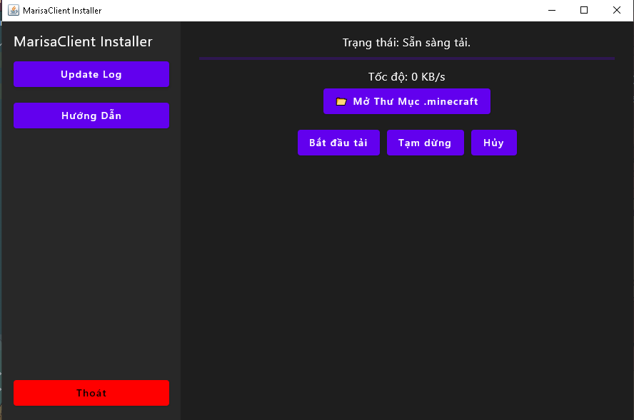

# MarisaApplication

* Phần mềm cài đặt MarisaClient (Minecraft Client Mod) 😊
* Bạn có thể chỉnh sửa hoặc sao chép mã nguồn mở này ❤️

## Hướng dẫn build

1. Clone github repository: `git clone https://github.com/hongminh54/MarisaApplication.git`.
2. Chạy cmd và ghi `./gradlew build fatJar`.
* Tệp bạn build sẽ nằm ở mục `build/libs`.
3. Sử dụng cmd và chạy lệnh `java -jar build/libs/MarisaApplication-1.0.jar` để chạy phần mềm.
* Hoặc bạn có thể sử dụng launch4j để convert jar thành exe để chạy phần mềm.

### Nếu bạn muốn đóng góp vào mã nguồn này bạn có thể, thay đổi mã nguồn rồi pull request.

### Hình ảnh
